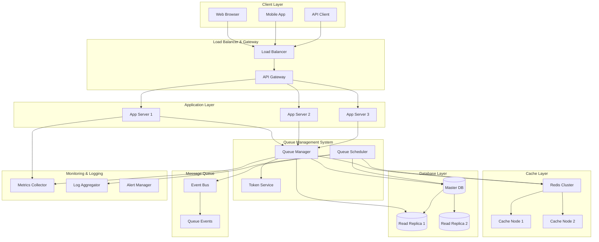

# 0. 아키텍처 분석

```mermaid
graph TB
    subgraph "Client Layer"
        WEB[Web Browser]
        MOBILE[Mobile App]
        API_CLIENT[API Client]
    end

    subgraph "Load Balancer & Gateway"
        LB[Load Balancer]
        GATEWAY[API Gateway]
    end

    subgraph "Application Layer"
        APP1[App Server 1]
        APP2[App Server 2]
        APP3[App Server 3]
    end

    subgraph "Queue Management System"
        QM[Queue Manager]
        QS[Queue Scheduler]
        TOKEN_SERVICE[Token Service]
    end

    subgraph "Cache Layer"
        REDIS_CLUSTER[Redis Cluster]
        CACHE_NODE1[Cache Node 1]
        CACHE_NODE2[Cache Node 2]
    end

    subgraph "Database Layer"
        MASTER_DB[(Master DB)]
        SLAVE_DB1[(Read Replica 1)]
        SLAVE_DB2[(Read Replica 2)]
    end

    subgraph "Message Queue"
        EVENT_BUS[Event Bus]
        QUEUE_EVENTS[Queue Events]
    end

    subgraph "Monitoring & Logging"
        METRICS[Metrics Collector]
        LOGS[Log Aggregator]
        ALERT[Alert Manager]
    end

    WEB --> LB
    MOBILE --> LB
    API_CLIENT --> LB
    
    LB --> GATEWAY
    GATEWAY --> APP1
    GATEWAY --> APP2
    GATEWAY --> APP3
    
    APP1 --> QM
    APP2 --> QM
    APP3 --> QM
    
    QM --> TOKEN_SERVICE
    QM --> REDIS_CLUSTER
    QM --> MASTER_DB
    QM --> SLAVE_DB1
    
    QS --> REDIS_CLUSTER
    QS --> MASTER_DB
    QS --> EVENT_BUS
    
    REDIS_CLUSTER --> CACHE_NODE1
    REDIS_CLUSTER --> CACHE_NODE2
    
    MASTER_DB --> SLAVE_DB1
    MASTER_DB --> SLAVE_DB2
    
    EVENT_BUS --> QUEUE_EVENTS
    
    APP1 --> METRICS
    QM --> METRICS
    QS --> LOGS
```

**핵심 컴포넌트**
  1. Queue Manager: 대기열 상태 관리 및 토큰 발급
  2. Queue Scheduler: 자동화된 사용자 활성화/만료 처리
  3. Token Service: 보안 토큰 생성 및 검증
