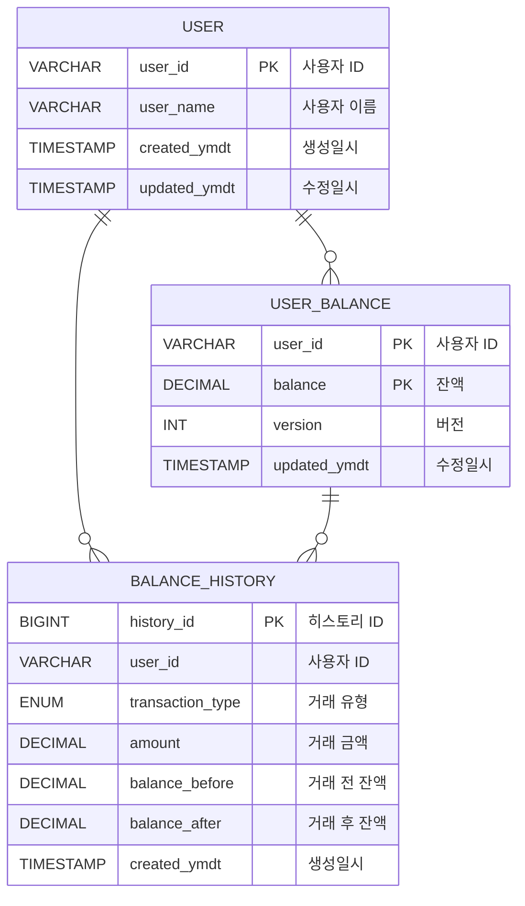
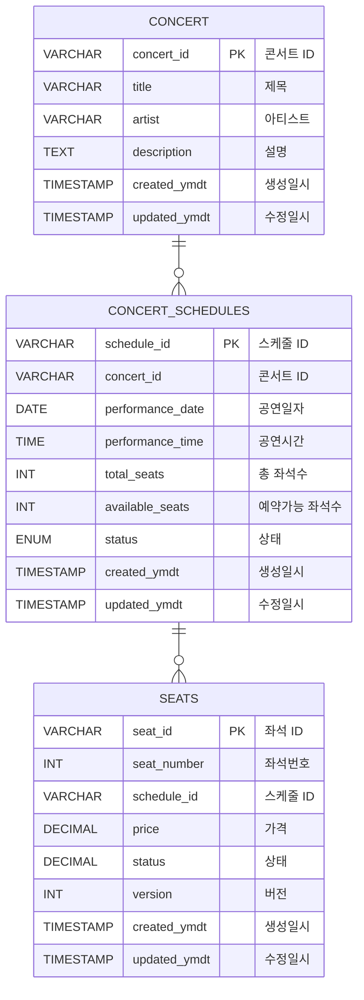
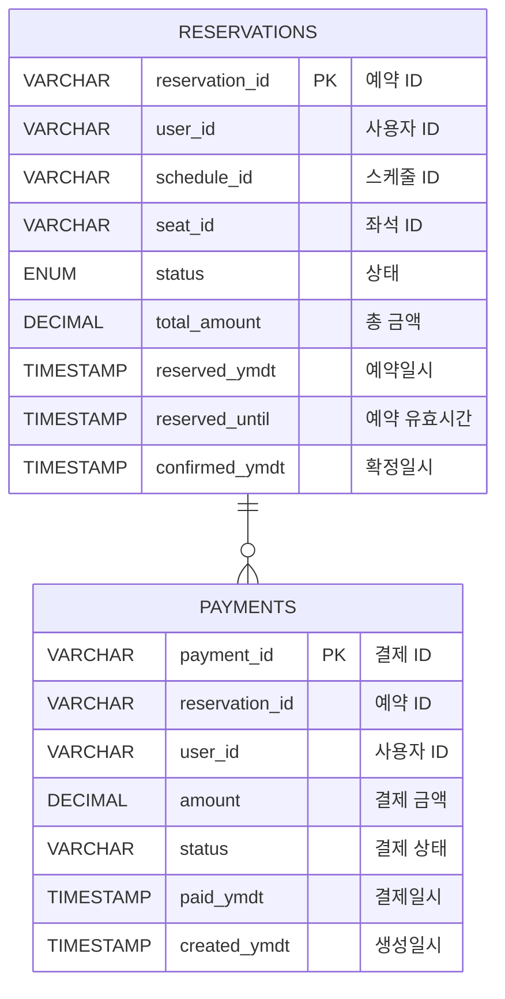
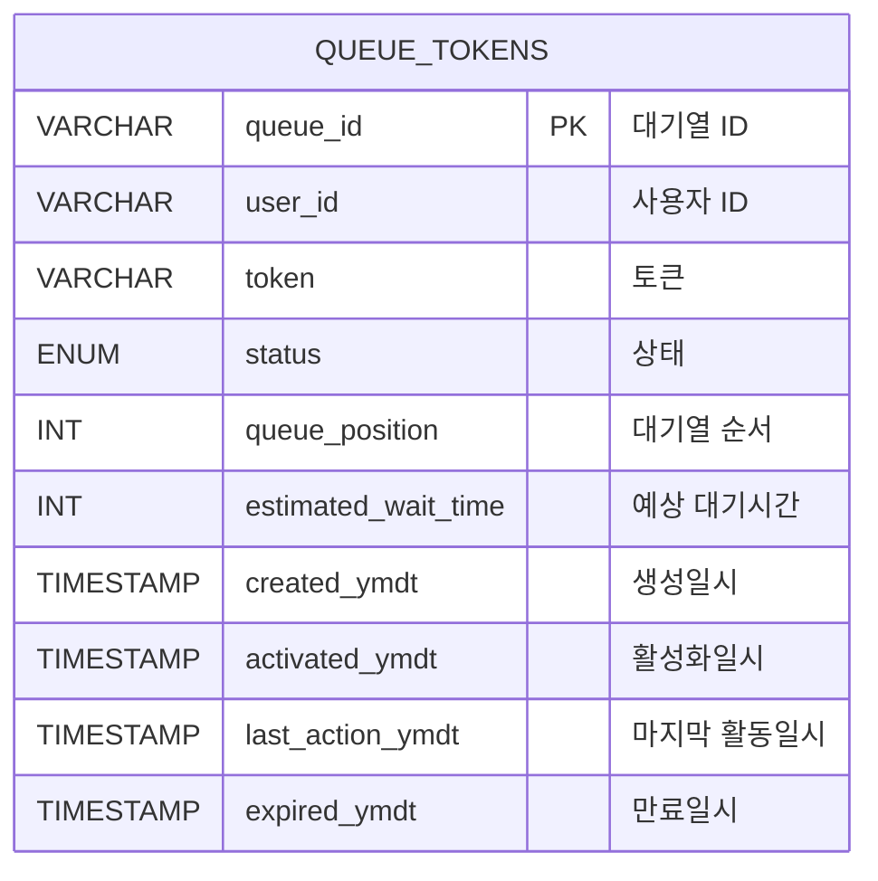

# ERD 다이어그램

### 사용자 && 잔액 관리
- `USER`: 사용자 정보를 저장하는 테이블
- `USER_BALANCE`: 사용자 잔액 정보를 저장하는 테이블
- `BALANCE_HISTORY`: 사용자 잔액 거래 내역을 저장하는 테이블

### 콘서트 예약 관리
- `CONCERT`: 콘서트 정보를 저장하는 테이블
- `CONCERT_SCHEDULES`: 콘서트 스케줄 정보를 저장하는 테이블
- `SEATS`: 콘서트 좌석 정보를 저장하는 테이블

### 예약 && 결제 관리
- `RESERVATIONS`: 예약 정보를 저장하는 테이블
- `PAYMENTS`: 결제 정보를 저장하는 테이블

### 대기열 토큰 관리
- `QUEUE_TOKENS`: 대기열 토큰 정보를 저장하는 테이블

