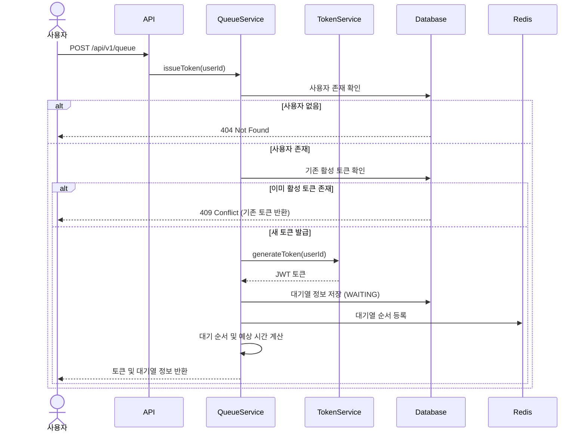
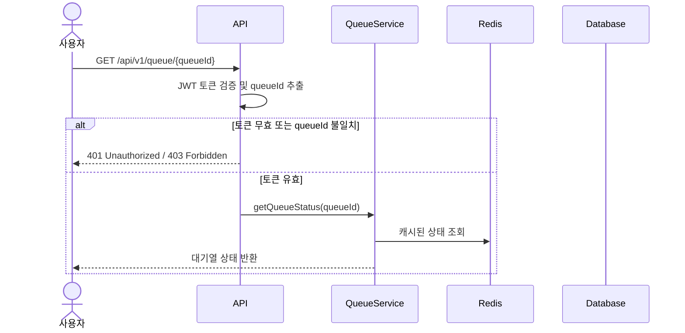
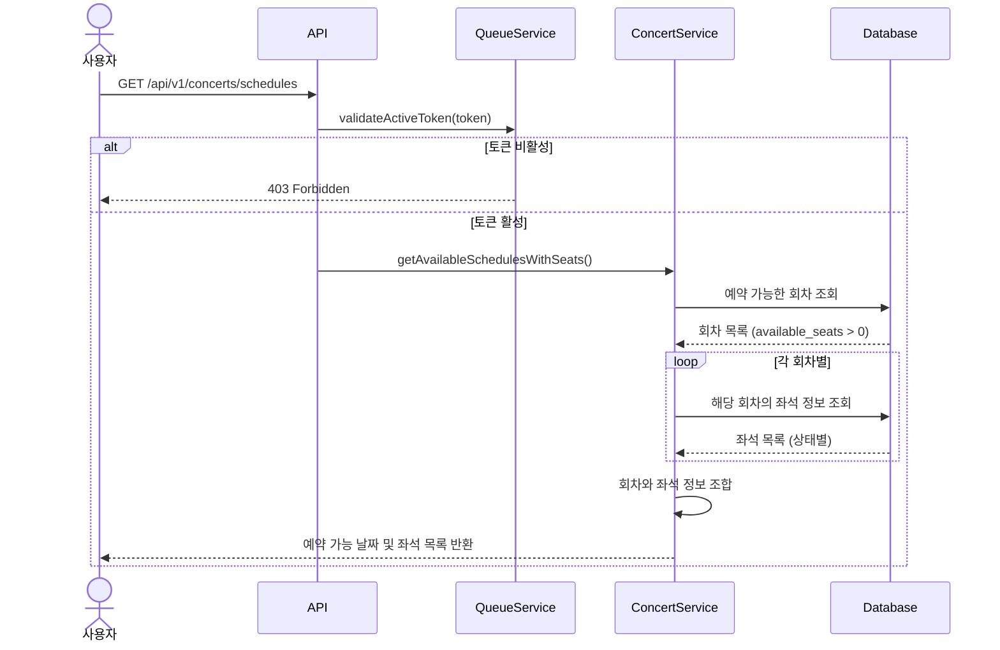
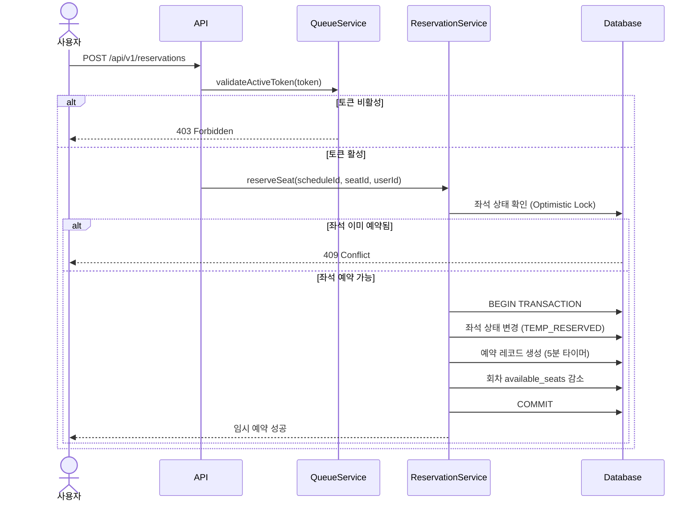
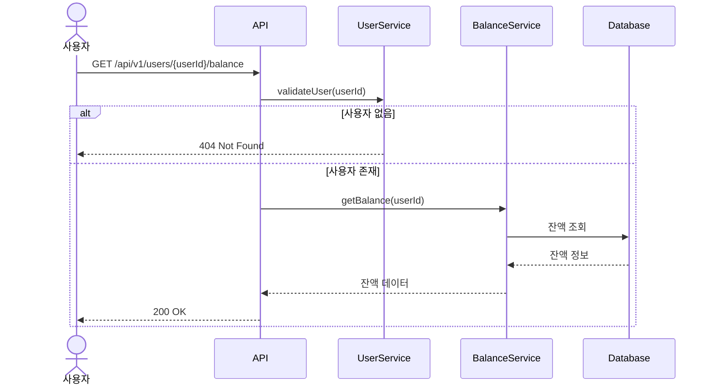
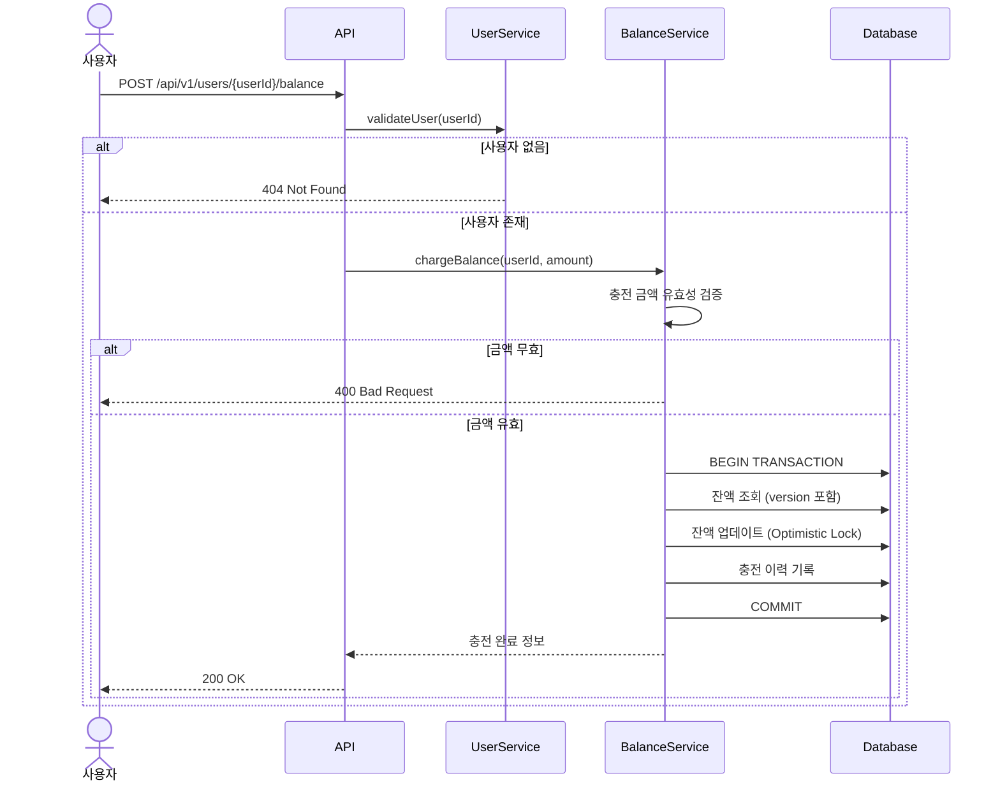
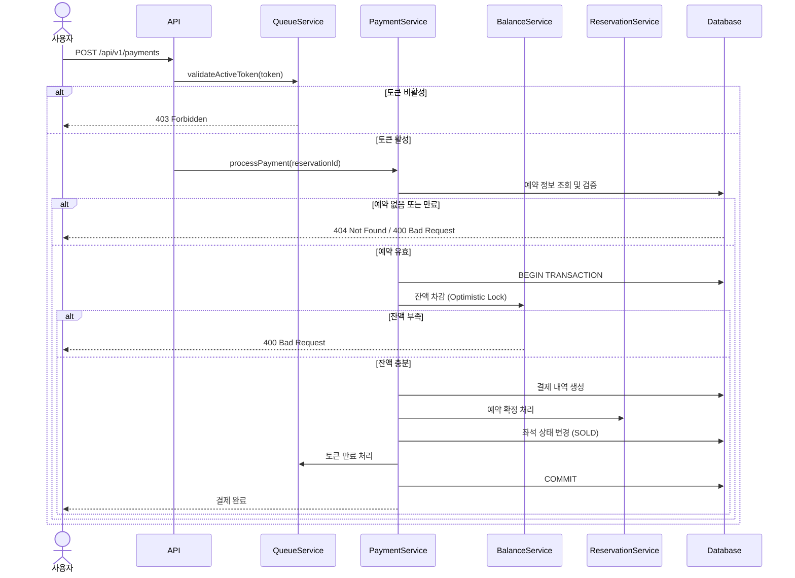

# 시퀀스 다이어그램
### 1️⃣-1. 대기열 토큰 발급 API

```mermaid
sequenceDiagram
    actor 사용자
    participant API
    participant QueueService
    participant TokenService
    participant Database
    participant Redis

    사용자->>API: POST /api/v1/queue
    API->>QueueService: issueToken(userId)

    QueueService->>Database: 사용자 존재 확인
    alt 사용자 없음
        Database-->>사용자: 404 Not Found
    else 사용자 존재
        QueueService->>Database: 기존 활성 토큰 확인
        alt 이미 활성 토큰 존재
            Database-->>사용자: 409 Conflict (기존 토큰 반환)
        else 새 토큰 발급
            QueueService->>TokenService: generateToken(userId)
            TokenService-->>QueueService: JWT 토큰
            QueueService->>Database: 대기열 정보 저장 (WAITING)
            QueueService->>Redis: 대기열 순서 등록
            QueueService->>QueueService: 대기 순서 및 예상 시간 계산
            QueueService-->>사용자: 토큰 및 대기열 정보 반환
        end
    end
```
### 1️⃣-2. 대기 번호 조회 API

```mermaid
sequenceDiagram
    actor 사용자
    participant API
    participant QueueService
    participant Redis
    participant Database

    사용자->>API: GET /api/v1/queue/{queueId}
    API->>API: JWT 토큰 검증 및 queueId 추출
    alt 토큰 무효 또는 queueId 불일치
        API-->>사용자: 401 Unauthorized / 403 Forbidden
    else 토큰 유효
        API->>QueueService: getQueueStatus(queueId)
        QueueService->>Redis: 캐시된 상태 조회
        QueueService-->>사용자: 대기열 상태 반환
    end
```

### 2️⃣ 기본 예약 가능 날짜 / 좌석 API

```mermaid
sequenceDiagram
    actor 사용자
    participant API
    participant QueueService
    participant ConcertService
    participant Database

    사용자->>API: GET /api/v1/concerts/schedules
    API->>QueueService: validateActiveToken(token)
    alt 토큰 비활성
        QueueService-->>사용자: 403 Forbidden
    else 토큰 활성
        API->>ConcertService: getAvailableSchedulesWithSeats()
        ConcertService->>Database: 예약 가능한 회차 조회
        Database-->>ConcertService: 회차 목록 (available_seats > 0)

        loop 각 회차별
            ConcertService->>Database: 해당 회차의 좌석 정보 조회
            Database-->>ConcertService: 좌석 목록 (상태별)
        end

        ConcertService->>ConcertService: 회차와 좌석 정보 조합
        ConcertService-->>사용자: 예약 가능 날짜 및 좌석 목록 반환
    end
```

### 3️⃣ 좌석 예약 요청 API

``` mermaid
sequenceDiagram
    actor 사용자
    participant API
    participant QueueService
    participant ReservationService
    participant Database

    사용자->>API: POST /api/v1/reservations
    API->>QueueService: validateActiveToken(token)
    alt 토큰 비활성
        QueueService-->>사용자: 403 Forbidden
    else 토큰 활성
        API->>ReservationService: reserveSeat(scheduleId, seatId, userId)
        ReservationService->>Database: 좌석 상태 확인 (Optimistic Lock)
        alt 좌석 이미 예약됨
            Database-->>사용자: 409 Conflict
        else 좌석 예약 가능
            ReservationService->>Database: BEGIN TRANSACTION
            ReservationService->>Database: 좌석 상태 변경 (TEMP_RESERVED)
            ReservationService->>Database: 예약 레코드 생성 (5분 타이머)
            ReservationService->>Database: 회차 available_seats 감소
            ReservationService->>Database: COMMIT
            ReservationService-->>사용자: 임시 예약 성공
        end
    end
```

### 4️⃣-1 잔액 조회 API

```mermaid
sequenceDiagram
    actor 사용자
    participant API
    participant UserService
    participant BalanceService
    participant Database

    사용자->>API: GET /api/v1/users/{userId}/balance
    API->>UserService: validateUser(userId)
    alt 사용자 없음
        UserService-->>사용자: 404 Not Found
    else 사용자 존재
        API->>BalanceService: getBalance(userId)
        BalanceService->>Database: 잔액 조회
        Database-->>BalanceService: 잔액 정보
        BalanceService-->>API: 잔액 데이터
        API-->>사용자: 200 OK
    end
```

### 4️⃣-2 잔액 충전 API

```mermaid
sequenceDiagram
    actor 사용자
    participant API
    participant UserService
    participant BalanceService
    participant Database

    사용자->>API: POST /api/v1/users/{userId}/balance
    API->>UserService: validateUser(userId)
    alt 사용자 없음
        UserService-->>사용자: 404 Not Found
    else 사용자 존재
        API->>BalanceService: chargeBalance(userId, amount)
        BalanceService->>BalanceService: 충전 금액 유효성 검증
        alt 금액 무효
            BalanceService-->>사용자: 400 Bad Request
        else 금액 유효
            BalanceService->>Database: BEGIN TRANSACTION
            BalanceService->>Database: 잔액 조회 (version 포함)
            BalanceService->>Database: 잔액 업데이트 (Optimistic Lock)
            BalanceService->>Database: 충전 이력 기록
            BalanceService->>Database: COMMIT
            BalanceService-->>API: 충전 완료 정보
            API-->>사용자: 200 OK
        end
    end
```

### 5️⃣ 결제 API

```mermaid
sequenceDiagram
    actor 사용자
    participant API
    participant QueueService
    participant PaymentService
    participant BalanceService
    participant ReservationService
    participant Database

    사용자->>API: POST /api/v1/payments
    API->>QueueService: validateActiveToken(token)
    alt 토큰 비활성
        QueueService-->>사용자: 403 Forbidden
    else 토큰 활성
        API->>PaymentService: processPayment(reservationId)
        PaymentService->>Database: 예약 정보 조회 및 검증
        alt 예약 없음 또는 만료
            Database-->>사용자: 404 Not Found / 400 Bad Request
        else 예약 유효
            PaymentService->>Database: BEGIN TRANSACTION
            PaymentService->>BalanceService: 잔액 차감 (Optimistic Lock)
            alt 잔액 부족
                BalanceService-->>사용자: 400 Bad Request
            else 잔액 충분
                PaymentService->>Database: 결제 내역 생성
                PaymentService->>ReservationService: 예약 확정 처리
                PaymentService->>Database: 좌석 상태 변경 (SOLD)
                PaymentService->>QueueService: 토큰 만료 처리
                PaymentService->>Database: COMMIT
                PaymentService-->>사용자: 결제 완료
            end
        end
    end
```
