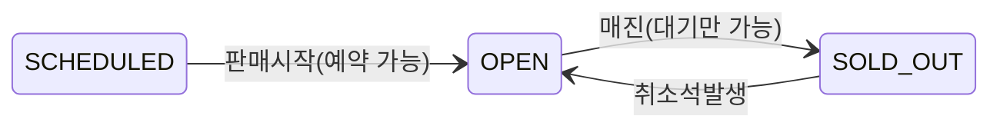
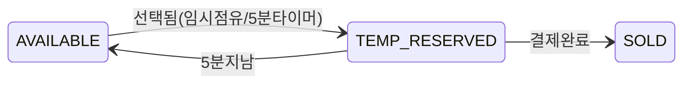
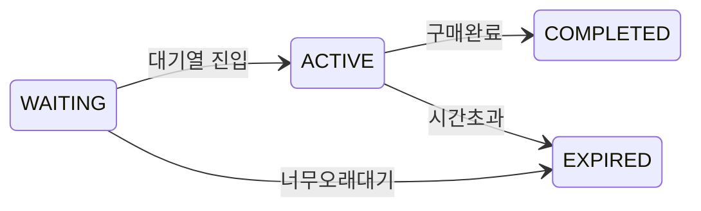
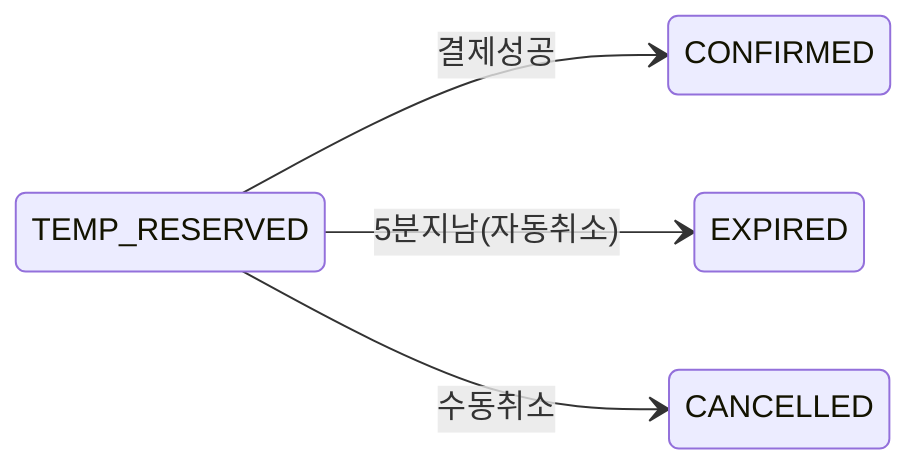
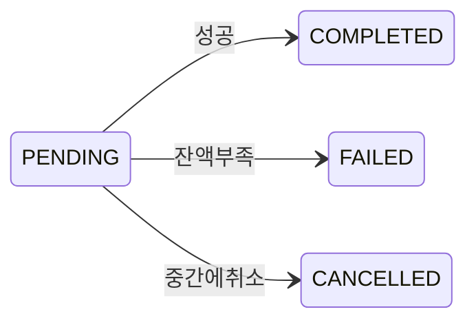

# 4. 상태 다이어그램
### 1. 회차 상태
- `SCHEDULED → OPEN`: 관리자가 "판매 시작" 버튼 클릭
- `OPEN → SOLD_OUT`: 마지막 좌석 판매 완료
- `SOLD_OUT → OPEN`: 누군가 취소해서 좌석 생김

```mermaid
stateDiagram-v2
    direction LR

    SCHEDULED --> OPEN : 판매시작(예약 가능)
    OPEN --> SOLD_OUT : 매진(대기만 가능)
    SOLD_OUT --> OPEN : 취소석발생
```
### 2. 좌석 상태

```mermaid
stateDiagram-v2
    direction LR
    
    AVAILABLE --> TEMP_RESERVED : 선택됨(임시점유/5분타이머)
    TEMP_RESERVED --> SOLD : 결제완료
    TEMP_RESERVED --> AVAILABLE : 5분지남

```
### 3. 대기열 토큰 상태

```mermaid
stateDiagram-v2
    direction LR
    
    WAITING --> ACTIVE : 대기열 진입
    ACTIVE --> COMPLETED : 구매완료
    ACTIVE --> EXPIRED : 시간초과
    WAITING --> EXPIRED : 너무오래대기
```
### 예약 상태

```mermaid
stateDiagram-v2
    direction LR
    
    TEMP_RESERVED --> CONFIRMED : 결제성공
    TEMP_RESERVED --> EXPIRED : 5분지남(자동취소)
    TEMP_RESERVED --> CANCELLED : 수동취소

```

### 결제 상태

```mermaid
stateDiagram-v2
    direction LR
    
    PENDING --> COMPLETED : 성공
    PENDING --> FAILED : 잔액부족
    PENDING --> CANCELLED : 중간에취소
```
